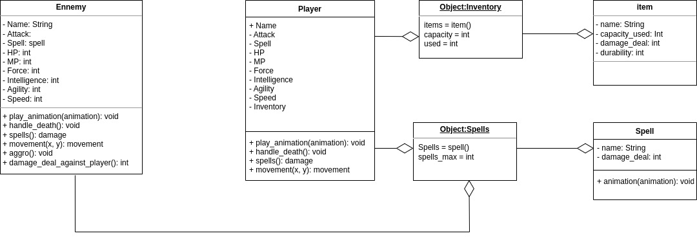
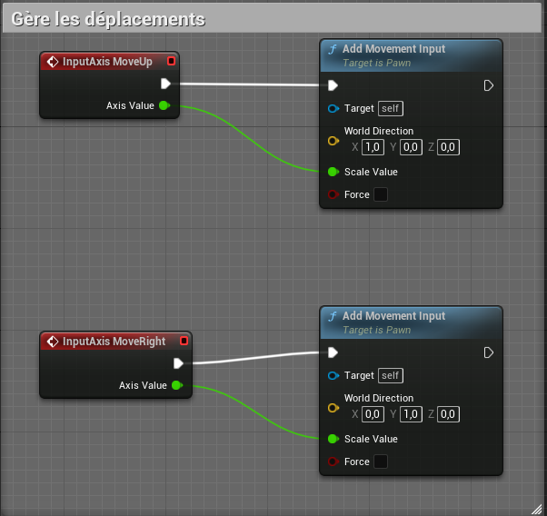
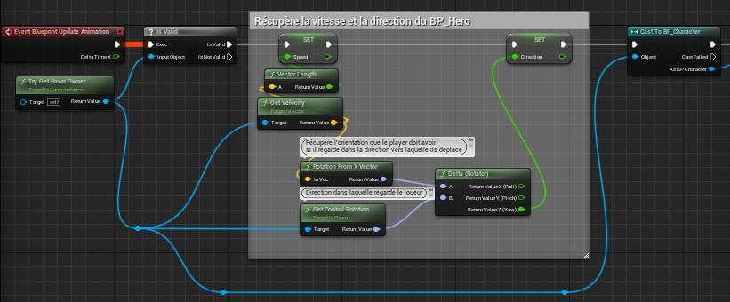
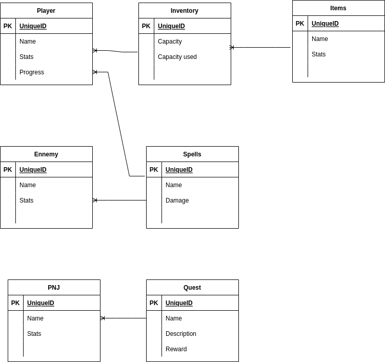
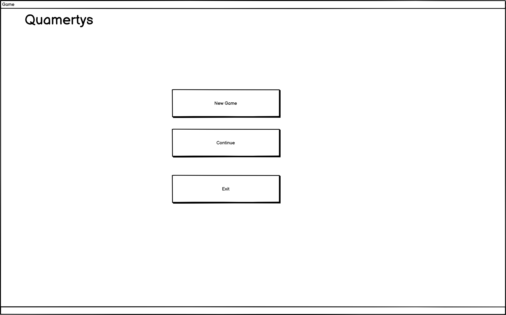
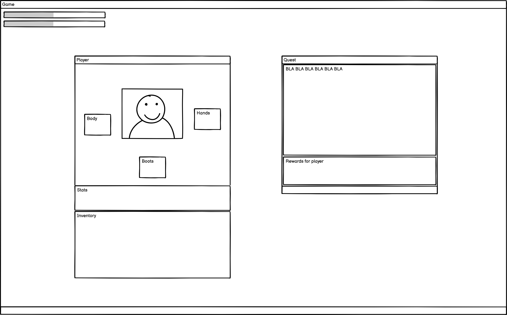

# MVP specification

## Architecture

## API

No API used for this project.

## Data Model

## User Stories

> As a player i can kill enemy, so i receive experience and items.

> In order to receive more rewards and experience as a player, i can complete quests.

> In order to be stronger as a player, i can get more experience and better items.

## Mockups

