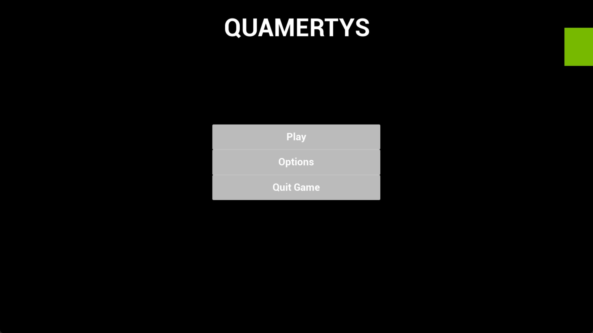
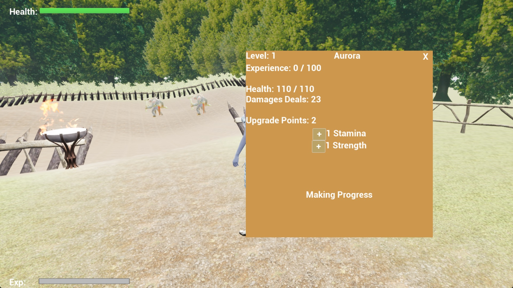

# MVP Progression

## Progress

### Scale

8/10

### Why this rating ?

1. NPC and quests features is not complete.
2. Others features is implemented, but not specify in the Kanban. Like sound and options for sounds.
3. I have just one class write in C++ and the technical code is not very developped. But i use the tools of Unreal Engine to develop my game.

### What's are completed as planned

1. The first map to try the first demo of the game and the mechanics.
2. The player character, movement, attacks and handle damages.
3. The ennemies character, movement, attacks, AI and handle damages.
4. The experience system
5. The main menu
6. The Options Menu
7. The HUD
8. The inventory menu
9. The Pause Menu
10. The Stats for the player, and initialization of stats.
11. The Gamemode
12. Sounds

## Challenges

### Technical challenges

1. The implementation of sounds options. That feature doesn't worked correctly during 2 days.
> Unreal documentation is very usefull to create the sounds options, but if that issue during 2 days, is because i do some PEBKAC. So, i think, friday i worked too much and my project build is not optimal.
2. The experience system to create a communication with ennemies and the player.
> But it's ok. That not a big issue.
3. The stats of the player when he died, is still loosed when the player respawn.
> For that, i use what i see with the sound implementation. Create a stats structure that it save in a tmp save file. When the player respawn, the game watch if the tmp_save exist and apply all the stats of the player.
4. The stats of the player when he first spawn start at 0.
> Player have some stats in the level 1. The player doesn't stat level 0. So for that, i just modify the default value of the stats struct i used.
5. The inventory of all stats take some issues. That need all stats of the player i need to communicate with player and inventory object. And, when i add a stat in stamina or strength i need to update the interface and the stats of the player in the same time.

### Non-technical challenges

1. Continuation of my zero motivation and moral. Impacting the advancement of my project, but objectively, 80% of my goal is checked.
> Try to be positive. But it's very difficult. I think this project needed to be created in team. For this experience, a solo project is very difficult to be stay motivate and this project can be better if i worked with someone else. But, this project is a good experience for my objective to go in AR/VR specilization and i go to create a team for my portfolio's project next time.
2. 70% of the unreal tutorials use BluePrint, documentation too. Is not easy to find a good documentation that use C++ to create a project.
> I have a documentation that used C++, but the videos take 2 hours + to watch. And thats videos implements features i don't need with my project.
3. Time we have is not enough for a solo project like this and create a beautiful project that is presentation friendly.
> But this is fine, i can make a good presentation, right ?
4. The exhausted of the end of the year. So yeah, when you see 3 months of projects that not correctly worked and not interesting. Yep, you are exhausted by that. Mainly when a school of 7K€ need 200 words in a documents, of no-one read, for dumb reason.

## Screenshots of the game

